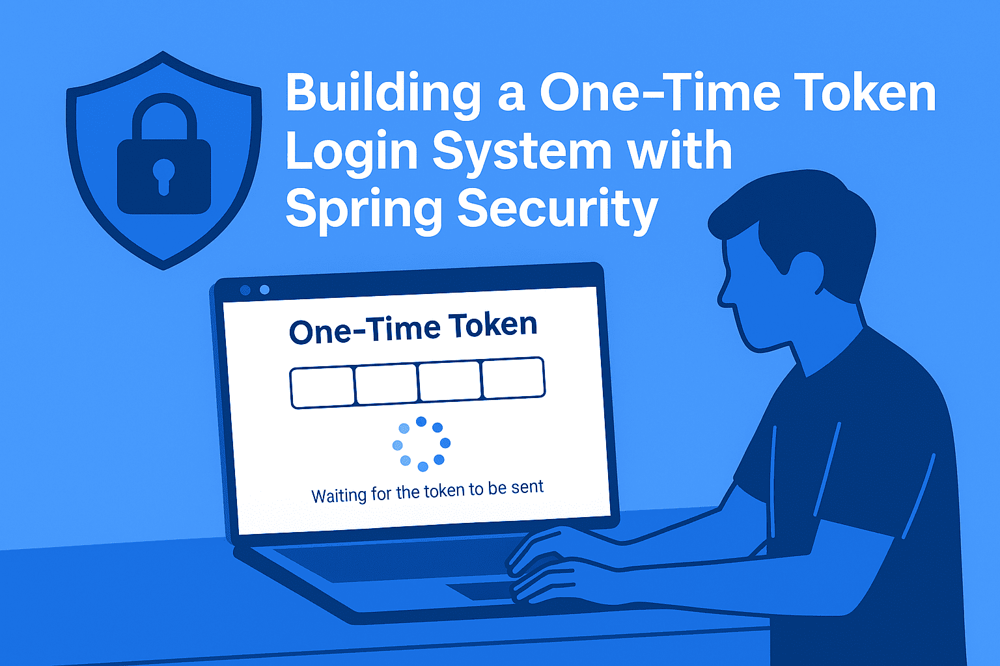
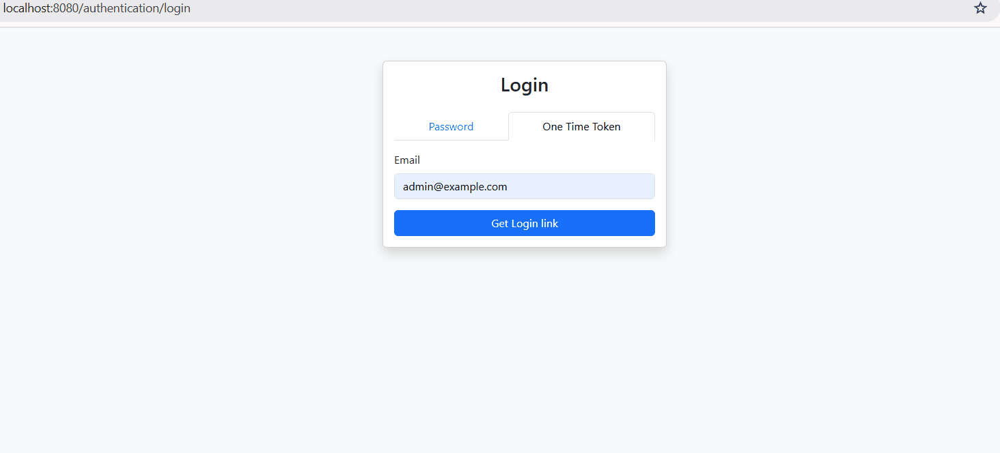

# Building a One-Time Token Login System with Spring Security



Imagine trying to keep track of all your passwords. It's a daunting task, isn't it? With passwords required for social media, online shopping, e-wallet apps, and various computer tools, it's easy to lose count. Forgetting a password can be frustrating, and having to create a new one every time can be a hassle.

Fortunately, there's a better and safer way to log in to websites: One-Time Tokens. Unlike traditional passwords, which are used repeatedly, One-Time Tokens provide a unique code that can only be used once. This token is designed to be used within a short timeframe, and once it's used or expires, it becomes invalid. It's like a secure, self-destructing message.

So, why are One-Time Tokens a better option than traditional passwords? Here are a few key benefits:

*  Enhanced Security: By reducing our reliance on passwords, we minimize the risk of password-related vulnerabilities. This means no more weak passwords, no more password reuse across different sites, and even if someone intercepts a token, it's likely to be expired and useless.

*  Improve User Experience: Let's face it, remembering passwords can be a pain. One-Time Tokens simplify the process, allowing users to click a link or enter a short code, making login a smoother experience.

*  Fewer Password Reset: With One-Time Tokens, the need for password resets decreases significantly. Since users don't have to constantly remember and re-enter passwords, there's less to forget in the first place.

Let's dive into the world of One-Time Tokens login with Spring Security! We will explore what they are and how we can actually implement them.

## One-Time Token Login: The Flow

1.  You navigate to the login page and enter your email address to start the process.
2.  The application generates a unique, one-time token. This token is a long, random string that's impossible to guess.
3.  The system sends this token to you via email, SMS, or WhatsApp.
4.  You receive the token and enter it on the login page. Often, you'll just click a magic link in the message that contains the token.
5.  The web application receives the token and checks:
    *   Is the token valid? (Does it match one we generated?)
    *   Has it expired? (One-time tokens have a short lifespan for security)
    *   Has it already been used? (Remember, it's one-time use only!)
6.  If everything checks out, you're logged in. The web application establishes a session for you.

## 💻 Let’s Build This Thing!

### Maven

To enable the One-Time Token feature, we need to include the `spring-boot-starter-security` and `spring-boot-starter-web` dependencies.

```xml
<dependencies>
        <dependency>
            <groupId>org.springframework.boot</groupId>
            <artifactId>spring-boot-starter-web</artifactId>
        </dependency>
        <dependency>
            <groupId>org.springframework.boot</groupId>
            <artifactId>spring-boot-starter-security</artifactId>
        </dependency>
</dependencies>
```

### Spring Security Configuration

Next, we configure the Spring Security and enable the form-login and One-Time Token Login:

```java
@Configuration
@EnableWebSecurity
public class SecurityConfig {

  @Bean
  public SecurityFilterChain securityFilterChain(
      HttpSecurity http,
      SendLinkOneTimeTokenGenerationSuccessHandler successHandler,
      CustomOneTimeTokenService customOneTimeTokenService)
      throws Exception {
    AuthenticationSuccessHandler ottLoginsuccessHandler =
        (request, response, authentication) -> response.sendRedirect("/");

    http.csrf(Customizer.withDefaults())
        .authorizeHttpRequests(
            authorize ->
                authorize
                    .requestMatchers("/error", "/", "/images/**", "/js/*.js", "/css/*.css")
                    .permitAll()
                    .requestMatchers(new AntPathRequestMatcher("/authentication/login"))
                    .permitAll()
                    .requestMatchers(new AntPathRequestMatcher("/logout"))
                    .permitAll()
                    .requestMatchers(new AntPathRequestMatcher("/webjars/**"))
                    .permitAll()
                    .requestMatchers(new AntPathRequestMatcher("/ott/sent"))
                    .permitAll()
                    .requestMatchers(new AntPathRequestMatcher("/ott/submit"))
                    .permitAll()
                    .anyRequest()
                    .authenticated())
        .formLogin(
            form ->
                form.loginPage("/authentication/login")
                    .loginProcessingUrl("/login")
                    .failureUrl("/authentication/login?failed")
                    .defaultSuccessUrl("/")
                    .permitAll())
        .headers(
            httpSecurityHeaders -> httpSecurityHeaders.frameOptions(FrameOptionsConfig::disable))
        .logout(Customizer.withDefaults())
        .oneTimeTokenLogin(
            configurer ->
                configurer
                    .tokenGenerationSuccessHandler(successHandler)
                    .tokenService(customOneTimeTokenService)
                    .showDefaultSubmitPage(false)
                    .authenticationSuccessHandler(ottLoginsuccessHandler));

    return http.build();
  }
}
```

- `@EnableWebSecurity` annotation: enable Spring Security's web security support and provide the Spring MVC integration.
- `SecurityFilterChain` bean to add custom filter in Spring Security Context.
- Configures `authorizeHttpRequests` defines which URL path should be secured and which should not.
- Configures `formLogin()` to customize the form based authentication. Configures `loginPage()` for redirecting to `/authentication/login` if authentication is required. Configures `loginProcessingUrl` to validate the submitted credentials. `failureUrl` specify the URL to send users if authentication fails.
- Configures `headers()`. We enable all the default headers except the X-Frame-Options headers.
- `.logout(Customizer.withDefaults())` provides logout support using default settings. The default is that accessing the URL "/logout" will log the user out by invalidating the HTTP Session, cleaning up any `rememberMe` authentication that was configured, clearing the `SecurityContextHolder`, and then redirect to `/login?success`.

Enable One-Time Token Login support and customize it with `oneTimeTokenLogin()` method :
- `tokenGenerationSuccessHandler` : Specifies strategy to be used to handle generated one-time tokens. We will create a custom handler that implements `OneTimeTokenGenerationSuccessHandler`.
- `tokenService` : Configures the `OneTimeTokenService` used to generate and consume the `OneTimeToken`.
- `showDefaultSubmitPage(false)` : disable the default One-Time Token submit page.
- `authenticationSuccessHandler` : Specifies the `AuthenticationSuccessHandler` strategy used to handle a successful user authentication. For demo, we redirect user to the home page.

### Custom OneTimeTokenGenerationSuccessHandler

Next, we need to implement a custom OneTimeTokenGenerationSuccessHandler to deliver the token to the end user.

```java
@Component
public class SendLinkOneTimeTokenGenerationSuccessHandler
    implements OneTimeTokenGenerationSuccessHandler {

  private final OttEmailService emailService;
  private final FlashMapManager flashMapManager = new SessionFlashMapManager();

  public SendLinkOneTimeTokenGenerationSuccessHandler(OttEmailService emailService) {
    this.emailService = emailService;
  }

  @Override
  @SneakyThrows
  public void handle(
      HttpServletRequest request, HttpServletResponse response, OneTimeToken oneTimeToken)
      throws IOException, ServletException {
    UriComponentsBuilder builder =
        UriComponentsBuilder.fromUriString(UrlUtils.buildFullRequestUrl(request))
            .replacePath(request.getContextPath())
            .replaceQuery(null)
            .fragment(null)
            .path("/ott/submit")
            .queryParam("token", oneTimeToken.getTokenValue());
    String link = builder.toUriString();
    CompletableFuture.runAsync(() -> emailService.sendEmail(oneTimeToken.getUsername(), link));

    RedirectView redirectView = new RedirectView("/ott/sent");
    redirectView.setExposeModelAttributes(false);
    FlashMap flashMap = new FlashMap();
    flashMap.put("token", oneTimeToken.getTokenValue());
    flashMap.put("ottSubmitUrl", link);
    flashMapManager.saveOutputFlashMap(flashMap, request, response);
    redirectView.render(flashMap, request, response);
  }
}
```

This component will do a number of things:

- Generate the magic link containing the one-time token.
- Call `emailService.sendEmail()` to send the email to the user with magic link.
- For demo, we redirect user to the `/ott/sent` page.

### Custom Success Page

Create a controller and an HTML template to handle this page. For demo purpose, we forward the token to the custom submit page.

```Java
@Controller
@RequestMapping("/ott")
public class OttController {
  @GetMapping("/sent")
  public String sent(Model model) {
    return "ott/sent";
  }

  @GetMapping("/submit")
  public String submit(Model model, @RequestParam("token") String token) {
    model.addAttribute("token", token);
    return "ott/submit";
  }
}
```

#### **`sent.html`**
```html
<html xmlns:th="http://www.thymeleaf.org" xmlns:layout="http://www.ultraq.net.nz/thymeleaf/layout"
        layout:decorate="~{layout}">
    <head>
        <title>OTT Sent</title>
    </head>
    <body>
        <div layout:fragment="content">
            <p>We just sent you an email. Please follow the provided link to log in.</p>
            <p>For testing here is the <a th:href="${ottSubmitUrl}">submit link</a></p>
        </div>
    </body>
</html>
```

#### **`submit.html`**
```html
<body>
    <div layout:fragment="content">
        <div class="d-flex flex-wrap mb-4">
            <h1 class="flex-grow-1">Login OTT</h1>
        </div>
        <form th:action="@{/login/ott}" method="post">
            <div class="row mb-3">
                <label for="token" class="form-check-label">Token</label>
                <input type="text" id="token" name="token" th:value="${token}" placeholder="Token" required="true"
                    autofocus="autofocus" class="form-control"/>
            </div>
            <button class="btn btn-primary" type="submit">Sign in</button>
        </form>
    </div>
</body>
```

### Custom OneTimeTokenService

Next, create a custom implementation of `OneTimeTokenService` interface. By customizing it, we can have a custom expire time, adding more info into token, and implement custom token value.

```java
@Service
public class CustomOneTimeTokenService implements OneTimeTokenService {
  private final Map<String, OneTimeToken> oneTimeTokens = new ConcurrentHashMap<>();

  private Clock clock = Clock.systemUTC();

  @Override
  @NonNull
  public OneTimeToken generate(GenerateOneTimeTokenRequest request) {
    String token = UUID.randomUUID().toString();
    Instant expiresAt = this.clock.instant().plus(5, ChronoUnit.MINUTES);

    OneTimeToken oneTimeToken = new DefaultOneTimeToken(token, request.getUsername(), expiresAt);
    oneTimeTokens.put(token, oneTimeToken);

    return oneTimeToken;
  }

  @Override
  @Nullable
  public OneTimeToken consume(OneTimeTokenAuthenticationToken authenticationToken) {
    log.info("Consume token: {}", authenticationToken.getTokenValue());
    OneTimeToken oneTimeToken = oneTimeTokens.remove(authenticationToken.getTokenValue());
    if (oneTimeToken == null || isExpired(oneTimeToken)) {
      return null;
    }
    return oneTimeToken;
  }

  private boolean isExpired(OneTimeToken oneTimeToken) {
    return this.clock.instant().isAfter(oneTimeToken.getExpiresAt());
  }
}
```

`CustomOneTimeTokenService` class responsible for:

- Generating the token and storing it. For demo, we use in memory store.
- Consuming the token, we validate the token expiration and delete the token from the store.

### Retrieving Users

Create custom `UserDetailsService` implementation to load user-specific data.

```java
@Service
@AllArgsConstructor
public class CustomUserDetailService implements UserDetailsService {

  private final UsersContainerClient usersContainerClient;

  @Override
  public UserDetails loadUserByUsername(String email) {
    UserRecord user = usersContainerClient.getUserByEmail(email);
    if (user == null) {
      throw new UsernameNotFoundException("User not found");
    }

    List<SimpleGrantedAuthority> authorities = new java.util.ArrayList<>();
    authorities.add(new SimpleGrantedAuthority("ROLE_USER"));

    if ("admin@example.com".equals(user.email())) {
      authorities.add(new SimpleGrantedAuthority("ROLE_ADMIN"));
    }

    return new org.springframework.security.core.userdetails.User(
        user.email(), user.password(), authorities);
  }
}
```

The user object is stored and fetched using the `UsersContainerClient` class, which will handle the interaction with GridDB Cloud.

```java
@Service
public class UsersContainerClient {
  private static final String CONTAINER_NAME = "Users";
  private final RestClient restClient;
  private final String baseUrl;

  public UsersContainerClient(
      @Value("${griddb.base-url}") String baseUrl,
      @Value("${griddb.auth-token}") String authToken) {
    this.baseUrl = baseUrl;
    this.restClient =
        RestClient.builder()
            .baseUrl(this.baseUrl)
            .defaultHeader("Authorization", "Basic " + authToken)
            .defaultHeader("Content-Type", MediaType.APPLICATION_JSON_VALUE)
            .build();
  }

  private <T> T post(String uri, Object body, Class<T> responseType) {
    try {
      return restClient.post().uri(uri).body(body).retrieve().body(responseType);
    } catch (GridDbException e) {
      throw e;
    } catch (Exception e) {
      throw new GridDbException(
          "Failed to execute POST request", HttpStatusCode.valueOf(500), e.getMessage(), e);
    }
  }

  public UserRecord getUserByEmail(String email) {
    String statement =
        String.format("SELECT id, email, name, \"password\" FROM Users where email == '%s'", email);
    return getOneUser(statement);
  }

  private UserRecord getOneUser(String statement) {
    String type = "sql-select";
    GridDbCloudSQLSelectInput input = new GridDbCloudSQLSelectInput(type, statement);
    var response = post("/sql", List.of(input), GridDbCloudSQLOutPut[].class);
    log.info("Output: {}", response[0]);
    if (response[0].results().size() == 0) {
      return null;
    }
    UserRecord foundUser = null;
    for (List<String> row : response[0].results()) {
      if (row.size() < 4) {
        break;
      }
      foundUser = new UserRecord(row.get(0), row.get(1), row.get(2), row.get(3));
    }
    log.info("Found user: {}", foundUser);
    return foundUser;
  }
}

record GridDbCloudSQLSelectInput(String type, @JsonProperty("stmt") String statement) {}

record GridDbCloudSQLOutPut(
    @JsonProperty("columns") List<GDCColumnInfo> columns,
    @JsonProperty("results") List<List<String>> results,
    @JsonProperty("responseSizeByte") long responseSizeByte) {}
```

- To communicate with GridDB Cloud via HTTP requests, we create a Spring `RestClient` instance with HTTP basic authentication.
- We `POST` the `sql-select` query and convert the response into `UserRecord`

### Demo

For demo, we have added demo users (`admin@example.com, user@example.com`) on application startup. Full code can be access on [Github](https://github.com/alifruliarso/springsecurity-ott/tree/main).



## Conclusion

One-time tokens are a great leap forward in enhancing online security while keeping things user-friendly. Using frameworks like Spring Security can make it easier to implement these advanced security measures.

When using one-time tokens in production, keep these key factors in mind:
- **Token Validity**: Decide how long each token should stay active.
- **Delivery Reliability**: Ensure your token delivery method is dependable.
- **Security**: Make sure the token generation process is cryptographically secure.
- **Storage Safety**: Store tokens securely to prevent unauthorized access.

By addressing these aspects, you can create a robust and user-friendly security system.